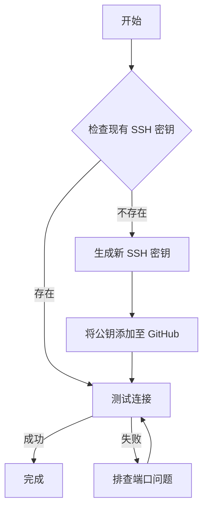
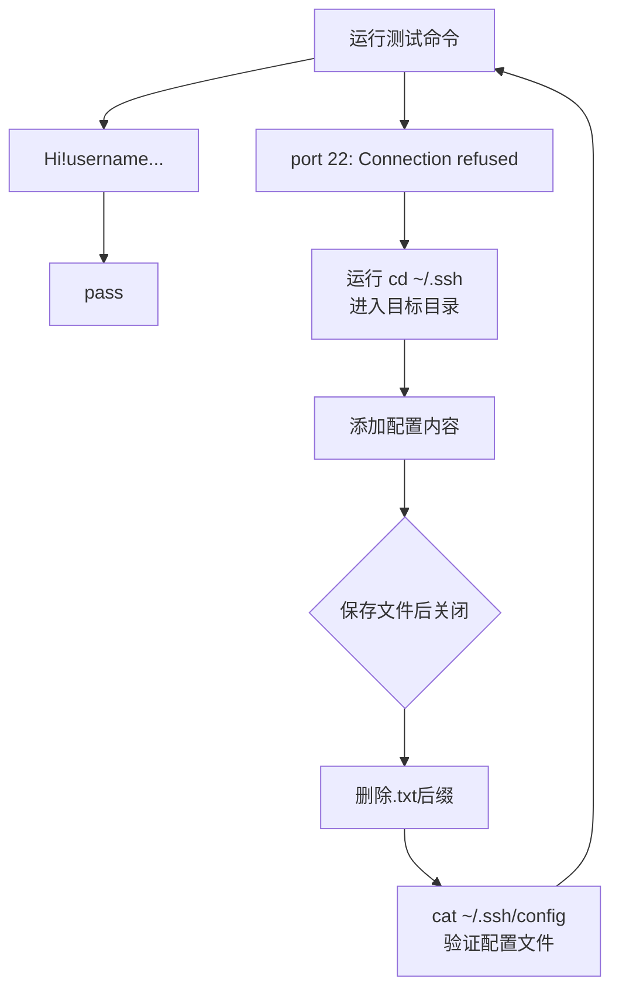

### SSH密钥配置与故障排查指南（Windows/PowerShell 环境）
- 文档版本：2.0
- 最后更新：2025-09-10
- 作者：杨璐（yli8i3@163.com）

#### 目标读者:
本指南适用于在windows系统使用powershell进行操作的初学者，读者需了解基础git命令行操作（如打开终端，切换目录等）。

#### 文档概述：
SSH（Secure Shell）密钥是一种安全的验证方式，用于不输入密码访问GitHub远程服务。本指南将引导您完成以下流程：


  
#### 1. 检查现有 SSH 密钥
1.1 检查本地密钥
在终端中执行以下命令，查看本地/.ssh目录下是否已存在密钥文件
```
#适用于powershell
Get-ChildItem -Force -Path "$env:USERPROFILE\.ssh"
或者
ls -Force ~/.ssh
或者
Get-ChildItem -Path ~/.ssh -Force**
#适用于git bash等类unix命令行工具
ls -al ~/.ssh
```
功能说明：查看目录下的文件。
输出说明：以常用的Ed25519算法为例，如果输出中包含类似id_ed25519（私钥）或id_ed25519.pub（公钥）的文件，说明已存在密钥。如果目录不存在或者为空，则需要新建密钥。

1.2 检查GitHub服务器的ssh公钥
首先访问Github SSH Keys设置页面；
在SSH keys列表中，检查是否存在与本地公钥匹配的条目。

#### 2.如何新建ssh密钥-以powershell为例
推荐使用Ed25519算法生成密钥对。

1.首先打开终端。

2.运行`ssh-keygen -t ed25519 -C "注释信息"`，将注释信息替换为您的邮箱地址。

3.根据提示操作：
- **"Enter file in which to save the key"**:输入保存地址，按enter选择默认地址（`$HOME\.ssh\id_ed25519`)
- **"Enter passphrase"**：为密钥设置密码，可选，按enter可以跳过
- 注意：如果需要自定义地址，地址的写法需要和命令行工具匹配，powershell中要使用绝对路径（`C:\Users\name\.ssh\id_ed25519`)；路径中最多只能包含一级尚未创建的目录。

#### 3.将SSH公钥添加到GitHub
1.在powershell中运行`cat ~/.ssh/id_ed25519.pub`，复制输出的公钥内容（`ssh-ed25519...`）

2.打开github-ssh-keys设置页面，点击**New SSH Key**，在**Title**字段中为密钥设置名称，描述使用范围或用途，在**Key**字段中输入复制的公钥内容，点击**Add SSH Key**。

#### 4.排查功能是否正常

1.核心命令：`ssh -T git@github.com`
可能的结果：
- `Hi YOUR_USERNAME! You've successfully authenticated, but GitHub does not provide shell access. #说明功能正常`
- `ssh: connect to host github.com port 22: Connection refused #常见原因是端口封锁，需要切换端口`

2.切换端口
如果默认的端口22被封锁，可以通过配置使用443端口。

- 运行cd ~/.ssh进入目标目录
- 在资源管理器新建文件，输入文件名`config`
- 打开文件输入以下内容：
Host github.com
  Hostname ssh.github.com
  Port 443
  User git
- 保存文件，关闭，
- 注意如果使用记事本添加配置文件，保存时记事本会自动添加txt后缀，导致无法识别，需要手动删除后缀
- 通过cat ~/.ssh/config可以确认配置文件是否正确



#### 5.其他
运行`ssh-keygen -p -f <密钥地址>`可以更换密码而无需新建密钥。


