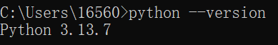

#  VS Code 快速入门指南
- 文档版本：1.0
- 最后更新：2025-10-26
- 作者：杨璐（yli8i3@163.com）
- 操作系统：操作步骤和截图均基于Windows 10/11操作系统。如果您使用macOS或Linux，安装、配置和部分操作细节会有所不同，建议您参考官方提供的其他安装指南。
  
## 目标读者
本教程适用于非技术背景，第一次接触代码编辑器的新手。我们假设你没有任何编程经验，仅使用过word或记事本处理文本。本教程将从软件下载开始引导你学习 VS Code 的安装、配置、熟悉核心功能，最终能够使用 VS Code 来编辑和运行你的代码。

## 文档概述
VS Code（全称Visual Studio Code）是一款微软开发的代码编辑器，支持Windows、macOS和Linux系统，具有完善的开发必备功能（如提示、调试），可以满足从简单脚本编写到复杂项目开发等多种需求。

本教程包含以下几个章节：  
安装，  
配置，    
核心功能。  

旨在帮助读者建立对 VS Code 的基础理解并完成相应操作。

## 1.安装 VS Code 
- 进入[ VS Code 官网](https://code.visualstudio.com)，点击`Download`下载安装包。

  

- 下载完成之后运行安装包，勾选“同意协议”


- 弹出选择安装位置的对话框

  建议点击“下一步”，即按照默认选项安装在C盘，避免出现权限问题

- 在开始菜单创建快捷方式

- 选择附加任务：

建议全部勾选，然后点击下一步

功能介绍(选读):
  - `创建桌面快捷方式`:功能是在电脑桌面上新建一个 VS Code 的图标，这样双击就可以打开软件
  - `将“通过 Code 打开”操作添加到 Windows 资源管理器**文件**上下文菜单`：功能是右键点击文件时可以通过 VS Code 打开文件
  - `将“通过 Code 打开”操作添加到 Windows 资源管理器**目录**上下文菜单`：功能是可以通过右键点击文件夹以在 VS Code 中打开文件夹
  - `将 Code 注册为受支持的文件类型的编辑器`：功能是让电脑默认使用VS Code打开代码文件
  - `添加到 PATH (重启后生效)`：功能是设置了 VS Code 的最高权限，启动更快捷  

- 等待安装完成即可，点击`完成`， VS Code 开始运行
  
## 2.配置

VS Code 开始运行之后，你首先看到的是欢迎页。初次见到欢迎界面可能会感到信息量较大，不用担心，依次进行以下操作即可：

### (1) 将语言切换成中文，立刻降低上手难度(下载中文扩展)

点击屏幕最左侧的`Extensions/扩展`，或者按`Ctrl+Shift+X`


在顶部搜索框输入`Chinese`

在搜索结果中找到由 Microsoft 发布的**Chinese (Simplified) Language Pack for Visual Studio Code**


点击`install`

弹出小提示框，按照提示重启软件


重新打开之后，页面就全部为中文了

### (2)安装`Python扩展`，让 VS Code “看得懂”python代码

下载Python扩展的方式与下载中文扩展一致，依然按照(1)的提示操作，在搜索框输入`Python`

在搜索结果中找到Microsoft发布的Python扩展，点击`安装`

安装完成之后， VS Code 就具有了运行、调试、理解Python代码的能力

### (3)安装`Python解释器`，真正可以执行代码的Python程序
进入[Python官网](https://www.python.org/downloads/)

点击黄色的`Download Python 3.13.7`按钮

下载完成之后运行安装包

安装时勾选`Add python.exe to PATH`，然后点击`Install Now`


验证安装是否成功：

在开始菜单搜索`CMD`并打开，在窗口输入`python --version`，然后回车

如果安装成功，会返回Python版本号信息


未返回版本号信息可以返回`（3）安装Pyhton解释器`按照教程重新安装一遍，重启CMD再次测试

### (4)选择Python解释器

在任何地方新建一个文件夹，例如 `C:\Users\[你的用户名]\Desktop\my_python_project`。用 VS Code 打开这个文件夹（打开 VS Code ，点击左上角`文件` -> `打开文件夹`）。

在 VS Code 左侧的资源管理器新建一个文件，命名为hello.py。


双击hello.py文件，在中央的工作区输入一行代码：`print("Hello, World!") `并保存。


点击 VS Code 右下角的`Select Interpreter`，或者按 Ctrl+Shift+P 打开命令面板，输入 `Python: Select Interpreter` 并选择它。


从弹出的列表中，选择你刚安装的 Python 版本（通常带有 Recommended 标签）。


如果列表中没有出现Python解释器，请尝试重启 VS Code ，或检查Python解释器是否安装成功。

至此，您已成功将该项目与您选择的Python解释器关联，点击运行时 VS Code 就会使用此解释器来运行代码。

## 3.核心功能

### 3.1 页面介绍

活动栏：页面左侧的图标，用于切换不同的功能面板

侧边栏：用于显示当前打开的面板，如资源管理器、扩展等

编辑器：中间区域，用于编写代码

面板：底部区域，用于显示终端、调试信息和问题等

状态栏：最底部条状区域，显示当前项目、git分支、Python解释器等信息


### 3.2 文件管理

在菜单栏点击`文件`可以打开和保存文件或文件夹，可以新建文件；

在资源管理器的标题菜单可以在当前目录下新建文件和文件夹；


资源管理器可以显示当前文件夹的文件结构，缩进表示文件或文件夹的从属关系；

通过快捷键 Ctrl + Tab 可以切换文件，通过快捷键 Ctrl + P 可以精准查找文件名称。

### 3.3 编辑

**语法高亮**： VS Code 会自动把关键字(如布尔值True，逻辑运算符and、or、not等)变成蓝色，把字符串(如"Hello,world！")变成橙色

**智能缩进**：在换行时，编辑器会为新行设置与上一行相同的缩进级别，在遇到需要缩进的语法结构时自动增加缩进。以Python为例，在工作区输入`def example_function():`之后回车,  VS Code 会自动缩进四个空格，标志着接下来输入的代码属于这个函数体，形成了一个代码块。

**行号显示**：为代码标注行号，易于定位出错位置，有助于提高协作中的沟通效率

**运行和调试**：点击工作区右上角的小三角即可运行代码，使用快捷键 CTRL＋`可以打开终端查看运行结果和报错信息

### 3.4 智能提示

#### (1) 代码自动补全：

当您输入时， VS Code 会分析上下文，提供完整变量名、函数名或类名。将输入法切换为英文状态，输入`pr`， VS Code 即提供可能的关键字，如`print`，点击即可自动补全

>Note: **变量**是一个用来存储数据值的标识符，可以理解成数据的容器或名称。**函数**是一段可复用的代码块，输入一个数据可以得到一个输出值，编程中的函数在数学函数的基础上发生了扩大。**类**是创建对象的模板，它定义对象的属性和方法。类的意义就像建筑的设计图。 


#### (2) 函数参数提示:

输入函数名和左括号时， VS Code 会显示该函数的参数列表。比如在工作区输入：
```
def test_function(param1,param2="default"):
    return param1 + param2
test_function
```
切换成英文输入状态，继续键入左括号，即可看到提示：


#### (3) 快速查看信息：

当您把鼠标悬停在一个变量、函数或类名上时，VS Code 会显示该元素的详细定义信息，比如元素的类型、来自哪个模块、以及相关的注释文档。

在上一条`函数参数提示`功能中的代码示例里，`param1`就是一种变量，`test_function`就是函数名。鼠标悬停在这些关键字上就可以看到类型和属性等信息。
                         


> Note: 被悬停的关键字有蓝色底纹，白色背景下更明显一些。切换主题色的方法是使用快捷键Ctrl+shift+P，搜索`Color Theme`，选择现代浅色或浅色。

#### (4) 代码导航：(进阶技巧，选读)

快速跳转和定位从而高效理解和浏览代码结构。包括**转到定义**、**查找引用**以及**符号跳转**。

**转到定义**：跳转到某个变量、函数、类或任何符号在代码中被最初声明或定义的地方。右键点击想要查看定义的关键字，下级菜单的第一条就是查看定义，也可以将光标放在目标关键字上按下F12查看。

> Note: 有的键盘使用F开头的快捷键需要搭配`Fn`键。

**查找引用**：列出使用某个符号的每一处代码。当您修改了一个函数名或一个变量值，通过查找引用功能可以全面准确地评估改动的影响范围。右键点击想要查找引用的关键字，在下级菜单中可以找到`转到引用`，也可以将光标放在目标关键字上按下 shift+F12 查看。

**符号跳转**:快速跳转到特定的代码结构而无需浏览全部文件。通过快捷键 Ctrl + Shift + O 可以打开符号列表，查看文件中所有的函数、方法、常量等等，在输入框中输入目标符号的几个字母就可以进行筛选，然后跳转到目标位置。

### 3.5 终端集成

终端集成是指 VS Code 内置的终端功能，它允许您在不离开编辑器的情况下直接运行命令行指令，从而提升开发效率。

什么是**终端**？终端是开发者与操作系统交互的工具（如 Windows 中的 Command Prompt 或 PowerShell，macOS/Linux 中的 Terminal）。

什么是**命令行**？命令行是用户在终端中输入并执行的一系列文本指令（如 dir，ls，cp，git commit 等），它提供了一种通过命令而非图形界面来直接操控计算机的高效方式。

如何**打开终端**？使用快捷键 Ctrl + ` 或 Ctrl + J

> Note: 反引号在键盘左上角，输入法需要切换为英文状态。
  

**终端的功能**是什么？

  运行代码：例如输入 `python hello.py` 可以直接运行代码。

  安装依赖项：使用 `pip install 包名` 安装 Python 库。通过安装库可以实现功能复用，提高开发效率。

  使用 Git：使用 `git add .`、`git commit` 等 Git 命令来管理代码版本，这部分内容在`版本控制基础`章节有详细介绍。

  查看输出和错误：程序运行结果和报错信息会直接显示在终端中。

### 3.6 版本控制基础

#### (1)什么是版本控制？

版本控制就像用word编辑文档时的`撤销`功能，但是比word功能更强大，他能够记录每次代码的改动，或者随时回到之前某个历史版本，多人协作时代码也不会互相覆盖。Git 是最常用的版本控制工具。

#### (2)在 VS Code 中初始化 Git

按 Ctrl + `打开终端，输入```git init```进行初始化，活动栏能看到一个由三个圆构成的图标，鼠标悬停可以看到说明文字```源代码管理```。


#### (3)提交代码

提交就相当于为游戏进度设置存档，提交的方式有两种，一种是打开源代码管理进行提交，一种是通过在终端输入`git commit -a -m "提交信息"`，提交信息是对代码内容或代码更新的说明。

通过源代码管理提交：


通过终端输入命令行提交：


#### (4)基础 Git 工作流程

通过 Git 进行代码的版本控制基于终端和命令行。

查看当前状态： git status

将文件修改添加到暂存区：git add [文件名称]

提交更改：git commit -m "说明信息"

查看提交历史：git log

>Note：暂存区的意义就约等于购物车，想象一下你在双11加购了很多商品，你一定会一起结账，而非分别付款。同理，当你完成了某个功能更新的一部分时，你可以先将这部分代码暂存，最后将完整代码提交，形成一个完整的代码版本。

#### (5)实用功能

查看对比视图：打开源代码管理，点击修改的文件，工作区中绿色为新增的内容，红色为删除的内容


### 3.7 调试入门

#### (1)什么是调试？

简单来说，调试就是寻找并解决 bug ，需要调试的场景一般是代码未按预期运行，程序崩溃或报错，或开发人员需要理解代码的执行流程。

#### (2)第一步：准备工作

新建一个有错误的代码`debug_practice.py`来练习调试：

```
def calculate_average(numbers):
    total = sum(numbers)
    average = total / len(numbers)
    return average

# 测试数据
scores = [85, 92, 78, 90, 88]
result = calculate_average(scores)
print(f"平均分是：{result}")

# 这里故意制造一个错误
empty_scores = []
bad_result = calculate_average(empty_scores)
print(f"空列表的平均分是：{bad_result}")
```
点击运行，可以看到第一个运行结果正常显示，第二个则提示了错误信息。

#### (3)第二步：设置断点

什么是断点？为什么要设置断点？如何设置？

断点是程序的暂停点，就像电影被暂停，我们可以观察这一帧影像的所有细节，同理，程序运行到断点时会暂停执行，允许开发者检查此刻程序的内部状态。

设置断点可以解决仅凭错误信息无法直接指出的逻辑问题，同时也是理解复杂代码的数据流和控制流的最佳方式。

在行号前面单击即可添加一个断点，出现红色圆形说明添加成功，单击红色圆形可以取消此处的断点。


#### (4)第三步：启动调试

单击活动栏中的运行和调试。


选择调试器：


看到以下页面说明操作正确：


侧边栏中显示变量信息，工作区顶部显示工具栏，底部状态栏变红，说明程序正在调试状态下运行。

#### (5)工具栏介绍

位于工作区顶端。


按钮功能：

继续(F5):继续运行，直到下一个断点。

逐过程(F10):执行当前行代码，但不进入函数内部。

单步调试(F11):也就是逐语句，执行当前行代码且进入函数内部，如果当前行无函数调用则F11和F10功能一致。

单步跳出(Shift+F11):执行当前函数内剩余的所有代码，并返回到该函数的调用处，也就是在函数调用的下一条语句处暂停。

重启(Ctrl+Shift+F5):终止当前正在运行的调试会话，然后使用相同的配置重新启动调试。

停止(Shift+F5):立即终止当前的调试会话，结束正在运行的程序。常用于程序异常时或调试完成时，除此之外，尽量让程序自然停止而非强行终止。

#### (6)观察变量变化

通过变量窗口可以查看当前可访问的所有变量。Local 为局部变量，Global为全局变量。


>Note：作用域就是变量起作用的范围。

通过监视窗口可以实时监测特定的变量或表达式的当前值，计算有效表达式的结果，展开查看复杂数据结构的内部结构，如对象和数组。

点击加号，输入你想监控的变量名或表达式，回车即可添加。


鼠标悬停也可以直接查看变量值。

#### (7)寻找并修复错误

在这个以除法为基本逻辑的代码中，除数为零是一个可能的出错点，我们在监视窗口中添加`len(numbers)`，监测变量是否存在为零的时刻，导致了代码运行故障。

逐行调试，第三行提示错误信息，监控窗口同时显示变量为零，可确认异常类型为除零错误。


在第二行粘贴
```
if len(numbers) == 0:
  return(None)
```

重新运行，结果正常。

### 3.8 主题与个性化

#### (1)更换主题

使用快捷键`Ctrl+Shift+P`打开命令面板；

输入`Preferences: Color Theme`并点击确认；

显示主题列表，按上下键可以预览效果，确定后按回车确认更换主题。

#### (2)更换图标主题

使用快捷键`Ctrl+Shift+P`打开命令面板；

输入`Preferences: File Icon Theme`并点击确认；

选择喜欢的图标主题，回车确认。

#### (3)字体设置

合适的字体设置可以让代码更易读。

按 ```Ctrl+, ```，打开设置；

搜索 `font`，找到 `Editor: Font Family`。

推荐字体：**Consolas，Courier New，monospace**

通过 `Editor: Font Size` 可调整字体大小。

#### (4)其他实用功能

在设置中搜索并开启：

`editor.minimap.enabled`: true，显示代码缩略图

`editor.wordWrap`: on，自动换行

`files.Auto Save`: afterDelay，自动保存

`editor.renderWhitespace"` boundary，显示空格和制表符

### 3.9 常用快捷键

#### (1)文件操作

|快捷键|功能|
|:---:|:---:|
|Ctrl+N|新建文件|
|Ctrl+O|打开文件|
|Ctrl+S|保存当前文件|
|Ctrl+Shift+S|另存为|
|Ctrl+W|关闭当前文件|
|Ctrl+K Ctrl+W|关闭所有文件|
|Ctrl+K Ctrl+O|打开文件夹|

#### (2) 编辑操作
|快捷键|功能|
|:---:|:---:|
| Ctrl+C | 复制（未选中时复制整行）|
| Ctrl+X | 剪切（未选中时剪切整行）|
| Ctrl+V | 粘贴 |
| Ctrl+Z | 撤销 |
| Ctrl+Y | 重做 |
| Ctrl+D | 选中下一个相同单词 |
| Ctrl+Shift+L | 选中所有相同单词 |
| Ctrl+/ | 切换行注释 |

>Note:重做，指恢复被撤销的动作。

#### (3)导航操作

|快捷键|功能|
|:---:|:---:|
| Ctrl+G | 跳转到指定行 |
| Ctrl+P | 快速打开文件 |
| Ctrl+Shift+O | 跳转到符号 |
| Alt+← | 后退 |
| Alt+→ | 前进 |

#### (4)界面操作

|快捷键|功能|
|:---:|:---:|
| Ctrl+B | 切换侧边栏显示 |
| Ctrl+J | 切换面板显示 |
| Ctrl+Shift+E | 显示资源管理器 |
| Ctrl+Shift+X | 显示扩展面板 |
| Ctrl+Shift+D | 显示运行和调试 |

### 3.10 插件推荐

丰富的插件是 VS Code 功能强大的来源之一，也是提升开发效率的重要工具。

#### (1)Python 相关

Pylance: Microsoft 出品，提供更快的 Python 语言支持

Python Docstring Generator: 自动生成函数文档注释

autoDocstring: 另一种文档注释生成工具，可以自动生成python标准化文档格式

#### (2)代码质量

GitLens: 增强 Git 功能，显示代码作者和提交历史

Error Lens: 在代码行内直接显示错误和警告信息

Code Spell Checker: 英文拼写检查，避免变量名拼写错误

#### (3)外观美化

Material Icon Theme: 漂亮的文件图标主题

Indent-Rainbow: 为缩进添加彩虹色，便于识别代码块

Todo Tree: 高亮显示代码中的 TODO、FIXME 等注释

## 4. 寻求帮助

访问官方文档：菜单栏 → 帮助 → 文档

键盘快捷键参考：菜单栏 → 帮助 → 键盘快捷键参考

## 5.结语

恭喜你完成了 VS Code 的快速入门！现在你已经掌握了：

✅ 基础操作：安装、配置、界面导航

✅ 核心功能：编辑、调试

✅ 求助途径：遇到问题知道如何解决

下一步建议：

实际项目练习：用 VS Code 开始你的第一个 Python 项目

逐步深入：每周学习一个高级功能

参与社区：关注 VS Code 更新，学习新特性

记住，熟练掌握任何工具都需要时间和实践。不要急于求成，享受学习的过程！


