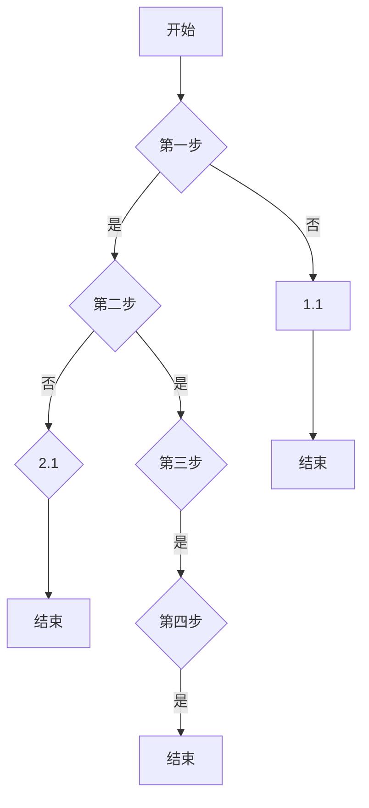

## 问题：
#### 由一个报错引发的决策树该如何书面呈现？
## 方案：
#### 线性排查，在故障点设置分支
## 图形示意：

```mermaid
flowchart TD
    A[开始] --> B  
    B{第一步} --是--> C{第二步} 
    C --否--> J{2.1}
    J --> K[结束]
    C --是--> G{第三步} 
    G --是--> H{第四步}
    H --是--> I[结束]
    B -- 否 --> D[1.1]  
    D --> F[结束]
```