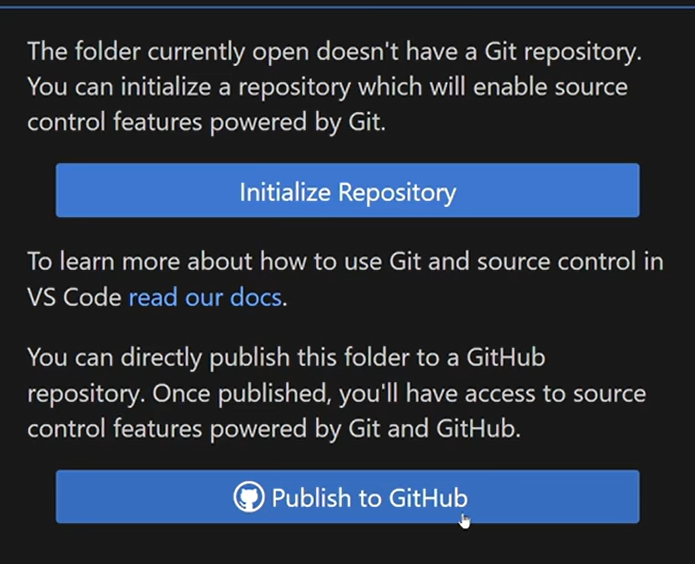

- 提交时不写标题(first/second save)会在屏幕右边继续弹出输入框，在这个新弹出的框输入标题需要手动ctrl＋s保存
- 克隆就是从远程仓库获取完成打工任务所需的资料，本地完成自己的任务之后再通过git push更新远程仓库的内容
- 存档、仓库、项目 三者是一个东西
- 怎么理解初始化(initialize)和发布(publish)?
  
  点击初始化后，当前文件夹就会多出一个.git文件夹,是git的可识别对象,通过初始化文件夹从本地文件变为git协作的一环
  通过Ctrl+`可以唤起内置终端,输入git init和点击initialize是一样的
  publish包含initialize,除了生成.git文件夹还会在github创建仓库,最终可以在github的网站上看到本地开发的代码
- 初始化后产生的.git文件夹就是**本地仓库**,而被初始化的文件夹和里面的文件都是这个仓库的外壳
- 新建了一个文件以后在资源管理器(explorer)显示标记U,含义是untracked,表示文件未被git追踪/没有进入协作,git不会自动追踪新建文件的更新,需要手动加入暂存区和本地仓库
- 文件做了更新以后,不保存会有小白点,CTRLs保存以后资源管理器会显示M,含义是modified,表示文件的修改没有提交
- 提交之前必须先进入暂存区,跳过add操作可以使用命令**git commit -a -m "提交说明"**
- 什么是暂存区？
  协作中处于本地目录的下游,本地仓库的上游,实体文件是.git中的index/cache,暂存区可以将两个更新过的文件打包提交，在提交记录里面两个文件是一起的，用于一个共同的功能或模块
- 什么是仓库(repository/repo)?
  - 可以查看文件变更历史,版本回滚,管理协作
  - 通常包括文件,提交历史,分支结构和标签
  - 本地仓库在开发者的计算机,常用命令是git add,git commit
  - 远程仓库在服务器上,比如GitHub,常用命令是git pull,git push
  - 执行git init之后,文件夹根目录会生成.git文件,包含objects(储存数据),refs(引用的分支和标签),config(配置文件),HEAD(指向当前分支的指针),index(暂存区)
  - 基于仓库的操作流程:
    - 克隆仓库:git clone https://github.com/user/…
    - 本地修改
    - 添加到暂存区:git add file.md,或者在源代码管理点加号
    - 提交到本地仓库:git commit -m "add function"
    - 提交到远程仓库:git pull origin main 
- git clone命令可以将一个项目完整复制到自己的电脑上进行工作,命令格式是==git clone <远程仓库地址> [本地文件夹名]==
- **git commit -m "message"** 是一个标准的提交文件更新到本地仓库的命令,-m表示massage提交信息,"message"是具体内容
- git status 可以查看文件夹下面的改动走到了协作的哪一环,保存了但没暂存,暂存了但是没提交
- git log 可以查看提交历史,追溯代码的演变,了解谁在什么时候做了修改
-  完整流程:新建文件夹/项目根目录/最大的文件夹,在vscode打开以后初始化,新建文件以后CTRLs,显示U,在源代码管理按加号添加到暂存区,确定后点提交,输入提交说明,保存到本地仓库