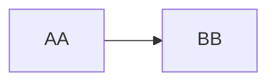

# markdown learning
1 **online courses**
> bilibili
> 

2 **practical operation**

1.download vscode
2.download modules

# practice examples
## 换行
two or more than two space followed by enter
the space of a whole line
## 分割线
三个及以上的星号
***
## 有序列表
1. a
2. b
3. c
## 无序列表
- e
- d
- f
## 表格＋字体
| 表头 | 表头 |
|:---:|:---:| 
|*斜体*|*　*|
|**粗体**|**　**|
|***斜粗体***|*** ***|
|==高亮==|== ==|

表头和下半拉要分割，分割的位置同时可以控制对齐和居中

## 脚注(脚注中符号全部为英文符号)
aa[^1]
脚注和正文之间会自带一条分割线
[^1]: two characters

## 代码的呈现
```
using namespace std;
int main(){
    print("hello world");
}
```
使用到的是反引号（1左边的键）
`print("hello world")`
## 链接
[联系我们](https://www.zhihu.com "点击跳转")

[知乎](https://www.zhihu.com "知识分享平台")

[购买产品][a]请点击[这里][b]
（必须空一行）

[a]: https://www.zhihu.com
[b]: https://www.zhihu.com

## 图片


difference with inserting link: exclamation point at the beginning (!)

## 嵌入html


## mermaid




## todo list
- [ ] markdown
- [x] git
- [ ] untitle

notice three space
