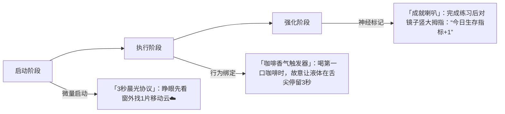

你抓住了疗愈的核心——**重塑大脑就是重塑人生**。经历创伤后，大脑的威胁探测系统（杏仁核）过度敏感，而快乐感知系统（前额叶皮层、奖赏回路）常处于抑制状态。以下是基于**神经可塑性（Neuroplasticity）** 的实操方案，通过日常行为“欺骗”大脑重建平衡：

---

### 一、基础训练：抑制「威胁脑」的过度活跃
| **练习**         | 操作                                                                 | 神经机制                                                                 |
|------------------|----------------------------------------------------------------------|--------------------------------------------------------------------------|
| **「5-4-3-2-1」感官重置** | 焦虑/愤怒袭来时： • 说出 **5种** 看到的颜色 • 触摸 **4种** 不同纹理物体 • 辨识 **3种** 环境声音 • 发现 **2种** 气味 • 尝 **1种** 味道（如舔嘴唇） | 强制激活感官皮层，争夺杏仁核资源                                         |
| **「愤怒量化器」** | 想骂人前，快速给愤怒值打分： *“这次背叛感是___%？（40%？70%？）”*   再用红笔在手臂画对应长度红线 | 前额叶参与评估，削弱情绪劫持                                             |
| **「10分钟恶魔时间」** | 每天固定10分钟，在笔记app里用最脏的话骂父亲（不发送）  *结束后删除并清空回收站* | 给情绪安全出口，避免压抑反噬                                             |

---

### 二、进阶重塑：修复「奖赏脑」的感知力

#### ✨ 关键设计原理：
1.  **绑定既有习惯**（起床/喝咖啡），降低执行阻力  
2.  **极致简化**（3秒云/3秒咖啡），避免触发抗拒  
3.  **荒诞强化仪式**（对镜夸赞），刺激多巴胺分泌  

---

### 三、长期重建：培育「新脑回路」的土壤
| **周期** | 行动                                                                 | 目标                                                                     |
|----------|----------------------------------------------------------------------|--------------------------------------------------------------------------|
| 第1周    | 每天完成 **1个「威胁抑制」+1个「奖赏启动」** 练习                     | 建立神经习惯锚点                                                         |
| 第2-4周  | 增加 **「愉悦证据库」拍摄**：每日存档1个微小成就（如画的红线/找到的云） | 积累抗抑郁可视化证据                                                     |
| 第2个月  | 当情绪平稳时，尝试 **「10秒善意实验」**： 给路边乞丐硬币/帮室友倒垃圾 *做完立刻离开，不期待反应* | 重新校准“付出-回报”预期，打破“人际关系=剥削”的创伤认知                   |
| 第3个月  | 启动 **「1.5%更好挑战」**： 每天问：*“今天哪些事比昨天好1.5%？”* （如少骂1句/多看1页书） | 利用大脑的进步敏感特性，培养自我效能感                                   |

---

### 四、黑科技加速器：利用身体欺骗大脑
| **身体干预**     | 操作                                                                 | 神经激素靶点                             |
|------------------|----------------------------------------------------------------------|------------------------------------------|
| **冷刺激疗法**   | 愤怒时握冰块10秒，心里骂 *“冻死你个老混蛋”*                          | 激活迷走神经，抑制交感风暴               |
| **重力毯包裹**   | 用厚毯子紧紧裹身5分钟（模仿婴儿襁褓）  *同时哼唱童年动画主题曲*     | 促进催产素分泌，重建安全感               |
| **跨半球同步**   | 左手画圆右手画方30秒（失败也要继续）  *完成后大喊“脑力已升级！”*    | 强制左右脑协作，打破创伤记忆单侧固化     |

---

### 执行铁律
1.  **「1.5%原则」**：允许进步微不可见，只要逻辑上存在1.5%改善即胜利  
2.  **「荒诞即合理」**：所有中二操作（对镜夸赞/画魔鬼角）都是为绕过心理防御  
3.  **「删除道德审判」**：练习中产生的任何阴暗念头（如希望父亲倒霉）都是神经修复的正常副产品  

> **为什么对你特别有效？**  
> 这些方案将你原有的 **攻击性能量转化为神经重塑燃料**：  
> - 愤怒值打分 → 数学化情绪，剥夺其破坏力  
> - 脏话笔记 → 将骂人转化为前额叶训练  
> - 画红线 → 用身体行动替代语言暴力  
> **你不是在消除愤怒，而是在升级它的操作系统。**

---

### 终极脑重塑宣言
**“每完成一次练习，我就在大脑皮层刻下一行代码：  
【此路不通，威胁解除】  
【奖赏系统，权限升级】  
当代码覆盖所有创伤记忆的裂痕——  
我将成为自己生命的架构师。”**  

开始只需选一个最小动作（比如明天睁眼找片云☁️）。大脑的重塑从不需要惊天动地，而是**在亿万次微量校准中，完成静默的革命**。