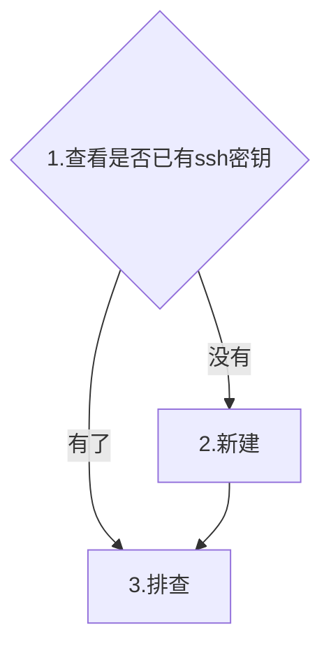
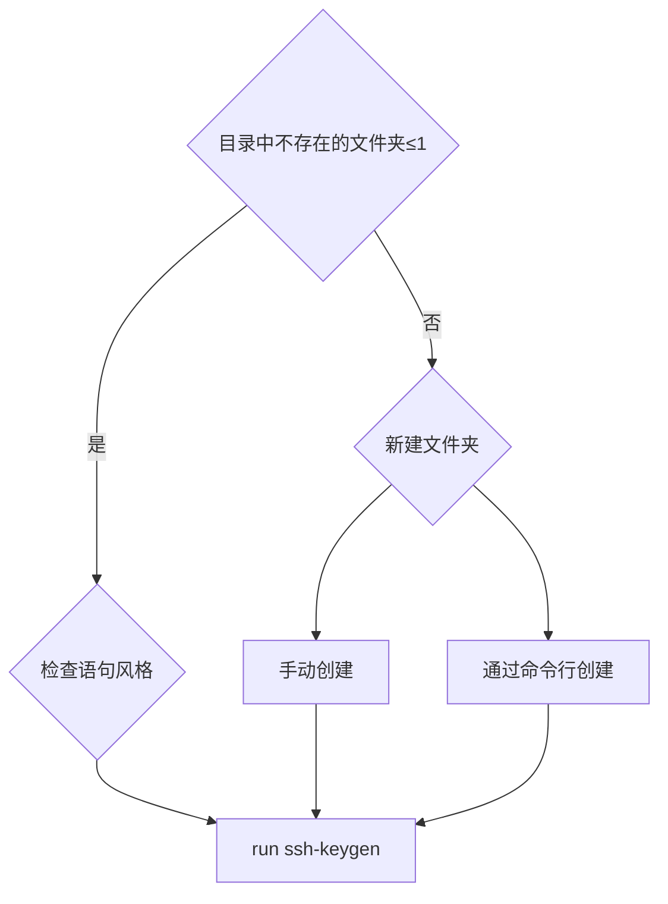
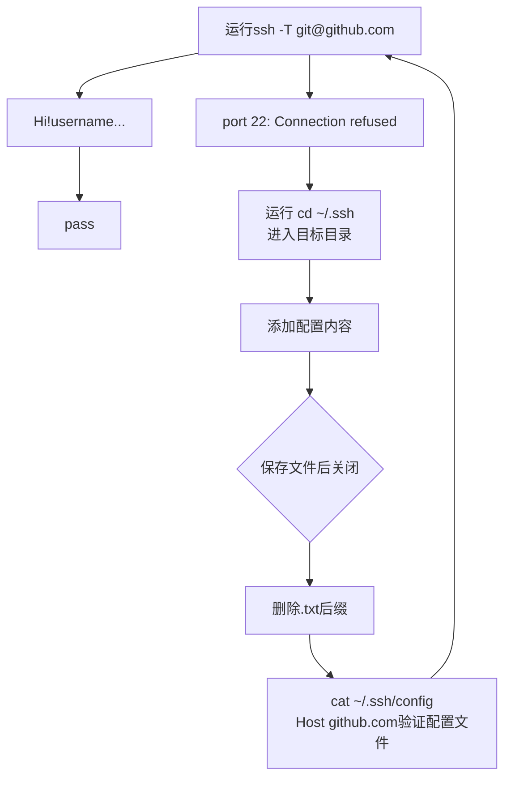

### SSH密钥配置与故障排查指南（Windows/PowerShell 环境）
- 文档版本：1.1
- 最后更新：2025-09-07
- 作者：杨璐（yli8i3@163.com）
- 适用受众/前置知识：目标读者: 初学者，需了解基础git命令行操作

#### 1.查看
1.1 查看本地是否已有ssh私钥的命令：
==powershell==使用Get-ChildItem -Force -Path "$env:USERPROFILE\.ssh"
或者
ls -Force ~/.ssh
或者
Get-ChildItem -Path ~/.ssh -Force**
==git bash==等类unix命令行工具使用ls -al ~/.ssh
功能是查看目录下的文件
以常用的Ed25519算法为例，如果输出中包含类似以下名称的文件，说明已存在密钥：
私钥：id_ed25519（无后缀）
公钥：id_ed25519.pub（带.pub 后缀）

1.2 查看GitHub服务器是否已有ssh公钥
在SSH keys列表中，查看是否有一条密钥的内容或标题与本地公钥匹配

#### 2.如何新建ssh密钥-以powershell为例
ssh-keygen -t ed25519 -C "注释信息"
在返回提示中输入**保存地址**,地址的写法需要和命令行工具匹配,powershell中要使用**C:\Users\name\.ssh\id_ed25519**,/home/name/...是类unix风格命令会报错;设置的目录可以包含不存在的文件夹,但是只能生成一级目录,如果目录包含两级不存在的文件夹也会报错；
powershell和类unix工具使用的命令行存在差异，类unix风格的命令行语句和语法在powershell不能正常运行。
运行ssh-keygen，生成可以但是保存会失败，提示无文件或目录。生成密钥是不需要文件基础的，而保存对文件基础有要求，因此生成的操作正常进行了，saving key/保存失败了

ssh-Keygen可以生成密钥的同时生成一级文件夹,两级就不行了.目录没问题依然报错的话可能是风格和工具没统一.目录的设置上,可以手动新建,可以通过命令行新建文件夹.

#### 3.排查功能是否正常
核心命令：ssh -T git@github.com
可能的结果：
3.1 显示**Hi YOUR_USERNAME! You've successfully authenticated, but GitHub does not provide shell access.**说明功能正常

3.2 显示ssh: connect to host github.com port 22: Connection refused

常见原因是端口封锁，需要切换端口
+ 运行cd ~/.ssh进入目标目录
+ 运行notepad config进入记事本
+ 添加配置内容
Host github.com
  Hostname ssh.github.com
  Port 443
  User git
+ 保存文件，关闭，注意这里记事本会自动添加txt后缀，可以通过命令行删，mv ~/.ssh/config.txt ~/.ssh/config，也可以去文件夹手动删
这个命令的作用是 将 .ssh 目录下名为 config.txt 的文件重命名为 config，原因是在记事本保存文件自带了后缀，无法识别，需要手动删掉，解决方法，去文件夹删和这个命令行都行
通过cat ~/.ssh/config可以确认配置文件是否正确

#### 4.其他
换密码
ssh-keygen -p -f <密钥地址$HOME\.ssh\id_ed25519>

